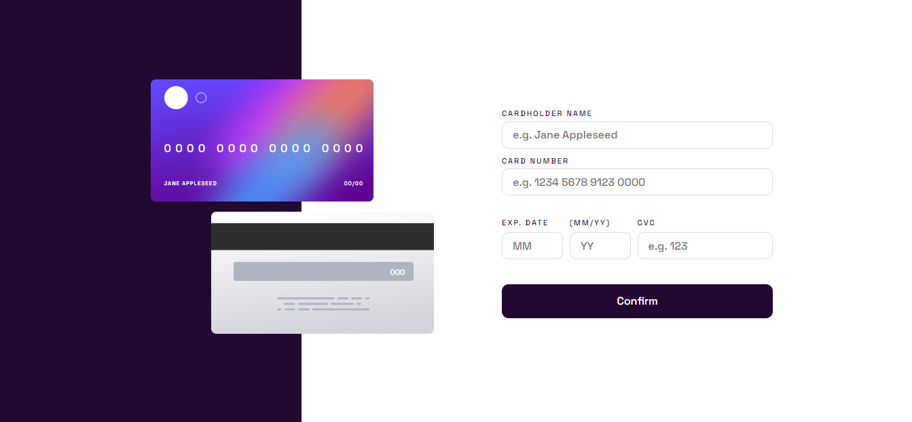

# Frontend Mentor - Intro component with sign up form solution

This is a solution to the [Interactive card details form challenge on Frontend Mentor](https://www.frontendmentor.io/challenges/interactive-card-details-form-XpS8cKZDWw). Frontend Mentor challenges help you improve your coding skills by building realistic projects. 

### Screenshot

### Links

- Solution URL: [Github](https://github.com/juanmderosa/interactive-cards-details-form)
- Live Site URL: [Github Pages](https://juanmderosa.github.io/interactive-cards-details-form/)

### Built with

- Semantic HTML5 markup
- CSS custom properties
- Flexbox
- CSS Grid
- Mobile-first workflow
- Responsive Design
- Javascript

